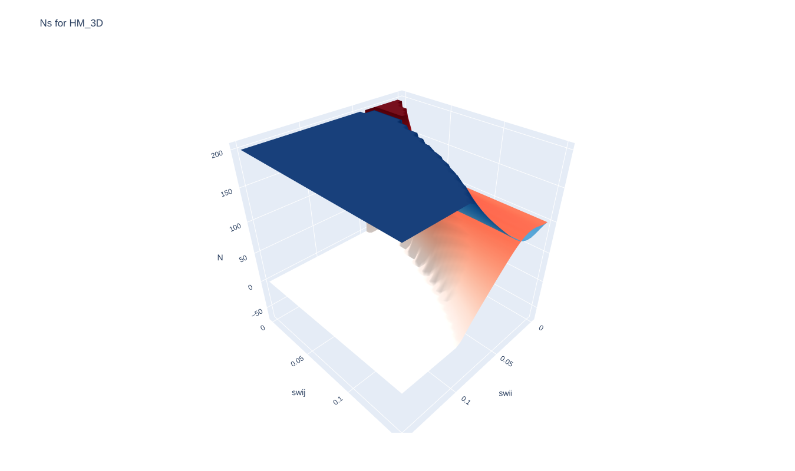
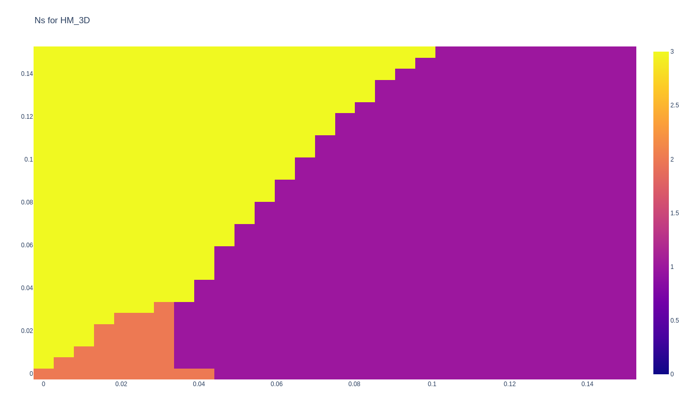
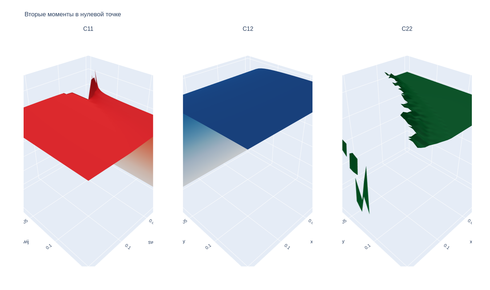
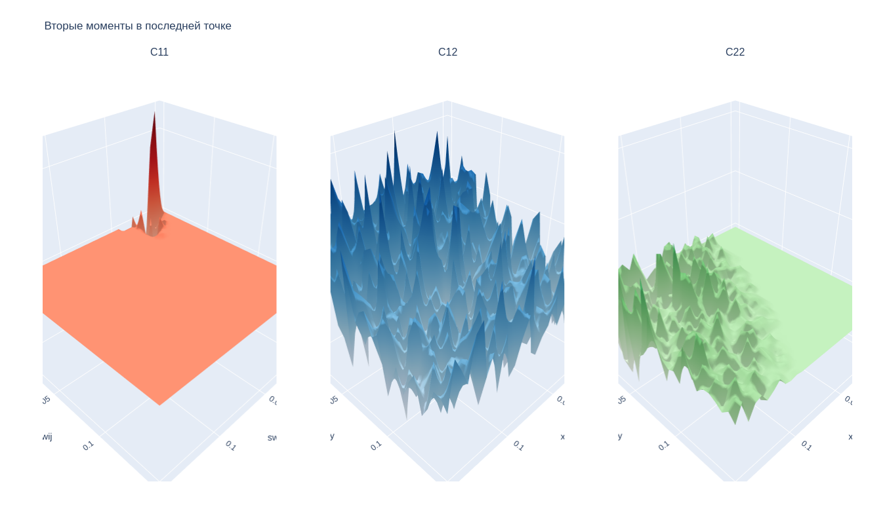

```python
!pip install cbor2
!pip install plotly
!pip install pandas
```

```python
import subprocess
from itertools import product
import numpy as np
import json
from copy import deepcopy
import cbor2
import plotly.graph_objects as go
import plotly
import plotly.express as px
from plotly.subplots import make_subplots

from os import path

from plotly.offline import init_notebook_mode
init_notebook_mode(connected = True)
```


<script type="text/javascript">
window.PlotlyConfig = {MathJaxConfig: 'local'};
if (window.MathJax && window.MathJax.Hub && window.MathJax.Hub.Config) {window.MathJax.Hub.Config({SVG: {font: "STIX-Web"}});}
if (typeof require !== 'undefined') {
require.undef("plotly");
requirejs.config({
    paths: {
        'plotly': ['https://cdn.plot.ly/plotly-2.26.0.min']
    }
});
require(['plotly'], function(Plotly) {
    window._Plotly = Plotly;
});
}
</script>


```python
COLORS = {
    'N1': 'b',
    'N2': 'r',
}

COOLORS_SCALE = (
    'Blues',
    'Reds',
)

'''
CMAPS = {
    'N1': cm.Blues,
    'N2': cm.Reds,
}
'''

LABELS_LATEX = {
    'N1': '$N_1$',
    'N2': '$N_2$',
}

def GetPlotParams(n):
    return {
        'label': LABELS_LATEX[n],
        'c': COLORS[n],
    }

def GetPlotParams3D(n):
    return {
        #'label': LABELS_LATEX[n],
        #'color': COLORS[n],
        'cmap': CMAPS[n],
    }
```


```python
FILE_PATH = 'HM_3D.json'

with open(FILE_PATH, 'r') as f:
    params = json.load(f)

base_shape = (params['x_len'], params['y_len'])
x_vec = np.ndarray(shape=base_shape[0])
y_vec = np.ndarray(shape=base_shape[1])

data_names = params.pop('datas')
for data_name in data_names:
    x_vec[data_name['i']] = data_name['x']
    y_vec[data_name['j']] = data_name['y']

points = params['points']
species = params['species']
title = params['title']
x_label = params['x_label']
y_label = params['y_label']

print(json.dumps(params, indent=4))
FOLDER = path.join(path.dirname(FILE_PATH), params['title'])
```

    {
        "species": 2,
        "a": 4.0,
        "alpha": 0.2,
        "b": [
            0.4,
            0.4
        ],
        "points": 16384,
        "d": [
            0.2,
            0.2
        ],
        "dd": [
            0.001,
            0.001,
            0.001,
            0.001
        ],
        "sigma_m": [
            0.04,
            0.06
        ],
        "sigma_w": [
            0.04,
            0.04,
            0.04,
            0.04
        ],
        "title": "HM_3D",
        "dim": 3,
        "x_label": "swii",
        "y_label": "swij",
        "x_len": 30,
        "y_len": 30
    }


```python
def get2DArray():
    return np.ndarray(shape=base_shape)


X, Y = np.meshgrid(x_vec, y_vec, indexing='ij')
Ns = np.ndarray(shape=(params['species'],) + base_shape)
Ds = np.ndarray(shape=(species, species,) + base_shape + (points,))

def FillDatas():
    for data_name in data_names:
        i = data_name['i']
        j = data_name['j']
        try:
            with open('{0}/{1}.cbor'.format(FOLDER, data_name['name']), 'rb') as f:
                obj = cbor2.load(f)
                
                for k in range(species):
                    for l in range(species):
                        Ds[k, l, i, j, :] = obj['D_{}_{}'.format(k + 1, l + 1)]
                    Ns[k, i, j] = obj['N_{}'.format(k + 1)]
        except Exception as e:
            print(e)
            pass

print(Ds.shape)
print(Ns.shape)
```

    (2, 2, 30, 30, 16384)
    (2, 30, 30)


```python
FillDatas()
```


```python
fig = go.Figure()
for i in range(species):
    fig.add_surface(z=Ns[i], x=X, y=Y, name='N{}'.format(i+1), colorscale=COOLORS_SCALE[i], showscale=False)
fig.update_layout(
    title='Ns for {title}'.format(title=title),
    autosize=True,
    width=800,
    height=800,
    margin=dict(l=65, r=50, b=65, t=90),
    scene={
        'xaxis_title': x_label,
        'yaxis_title': y_label,
        'zaxis_title': 'N',
    }
)
fig.show()
```



```python
contour = np.ndarray(shape=base_shape + (3,), dtype=np.uint8)
eps = 0.001

contour = get2DArray()
contour[np.bitwise_and(Ns[0] < eps, Ns[1] < eps)] = 0     # Оба вымерли
contour[np.bitwise_and(Ns[0] >= eps, Ns[1] < eps)] = 1    # Выжил только первый вид
contour[np.bitwise_and(Ns[0] < eps, Ns[1] >= eps)] = 2    # Выжил только второй вид
contour[np.bitwise_and(Ns[0] >= eps, Ns[1] >= eps)] = 3   # Сосуществование
contour = np.rot90(np.flip(contour, (1)))

fig = go.Figure()
fig.add_heatmap(
    z=contour,
    x=x_vec,
    y=y_vec,
    zmin=0,
    zmax=3,
)
fig.update_layout(
    title='Ns for {title}'.format(title=title),
    autosize=True,
    width=800,
    height=800,
    margin=dict(l=65, r=50, b=65, t=90),
    scene={
        'xaxis_title': x_label,
        'yaxis_title': y_label,
        'zaxis_title': 'N',
    }
)
fig.show()
```



```python
D11 = Ds[0, 0, :, :, 0] + 1
D12 = Ds[0, 1, :, :, 0] + 1
D22 = Ds[1, 1, :, :, 0] + 1

D11[D11 > 10] = np.nan
D12[D12 > 20] = np.nan
D22[D22 > 100000] = np.nan
D11[D11 < 0] = np.nan
D12[D12 < 0] = np.nan
#D22[D22 < 0] = np.nan

fig = make_subplots(rows=1, cols=3, subplot_titles=('C11', 'C12', 'C22'), specs=[[{'type': 'scene'} for _ in range(3)]])
fig.add_trace(go.Surface(z=D11, x=X, y=Y, name='D11', colorscale='Reds', showscale=False), row=1, col=1)
fig.add_trace(go.Surface(z=D12, x=X, y=Y, name='D12', colorscale='Blues', showscale=False), row=1, col=2)
fig.add_trace(go.Surface(z=D22, x=X, y=Y, name='D22', colorscale='Greens', showscale=False), row=1, col=3)
fig.update_layout(
    title='Вторые моменты в нулевой точке',
    autosize=True,
    width=2400, height=800,
    margin=dict(l=65, r=50, b=65, t=90),
    scene={
        'xaxis_title': x_label,
        'yaxis_title': y_label,
        'zaxis_title': 'N',
    }
)
fig.show()
```



```python
D11 = Ds[0, 0, :, :, -1]
D12 = Ds[0, 1, :, :, -1]
D22 = Ds[1, 1, :, :, -1]

#D11[D11 > 1.03] = np.nan
#D12[D12 > 20] = np.nan
#D22[D22 > 100000] = np.nan
#D11[D11 < 0] = np.nan
#D12[D12 < 0] = np.nan
#D22[D22 < 0] = np.nan

fig = plotly.subplots.make_subplots(rows=1, cols=3, subplot_titles=('C11', 'C12', 'C22'), specs=[[{'type': 'scene'} for _ in range(3)]])
fig.add_trace(go.Surface(z=D11, x=X, y=Y, name='D11', colorscale='Reds', showscale=False), row=1, col=1)
fig.add_trace(go.Surface(z=D12, x=X, y=Y, name='D12', colorscale='Blues', showscale=False), row=1, col=2)
fig.add_trace(go.Surface(z=D22, x=X, y=Y, name='D22', colorscale='Greens', showscale=False), row=1, col=3)
fig.update_layout(
    title='Вторые моменты в последней точке', autosize=True,
    width=2400,
    height=800,
    margin=dict(l=65, r=50, b=65, t=90),
    scene={
        'xaxis_title': x_label,
        'yaxis_title': y_label,
        'zaxis_title': 'N',
    }
)
fig.update_xaxes(title={'text': 'd12'}, showgrid=True)
fig.show()
```



```python
x_i = 15
xi_count = 1000

D11 = Ds[0, 0, x_i, :, :xi_count]
D12 = Ds[0, 1, x_i, :, :xi_count]
D22 = Ds[1, 1, x_i, :, :xi_count]

XI = np.linspace(0, params['a'], points)

X_, Y_ = np.meshgrid(
    y_vec,
    XI[:xi_count],
    indexing='ij',
)

D11[D11 > 100000] = np.nan
D12[D12 > 100000] = np.nan
D22[D22 > 100000] = np.nan
#D11[D11 < 0] = np.nan
#D12[D12 < 0] = np.nan
#D22[D22 < 0] = np.nan

fig = plotly.subplots.make_subplots(rows=1, cols=3, subplot_titles=('D11', 'D12', 'D22'), specs=[[{'type': 'scene'} for _ in range(3)]])
fig.add_trace(go.Surface(z=D11, x=X_, y=Y_, name='D11', colorscale='Reds', showscale=False), row=1, col=1)
fig.add_trace(go.Surface(z=D12, x=X_, y=Y_, name='D12', colorscale='Blues', showscale=False), row=1, col=2)
fig.add_trace(go.Surface(z=D22, x=X_, y=Y_, name='D22', colorscale='Greens', showscale=False), row=1, col=3)
fig.update_layout(
    title={
        'text': 'Вторые моменты для {}: {} for xi: [0, {}]'.format(x_label, x_vec[x_i], XI[xi_count])
    },
    autosize=True,
    width=2400,
    height=800,
    margin=dict(
        l=65,
        r=50,
        b=65,
        t=90
    ),
    scene={
        'xaxis_title': y_label,
        'yaxis_title': 'xi',
    }
)
fig.show()
```


